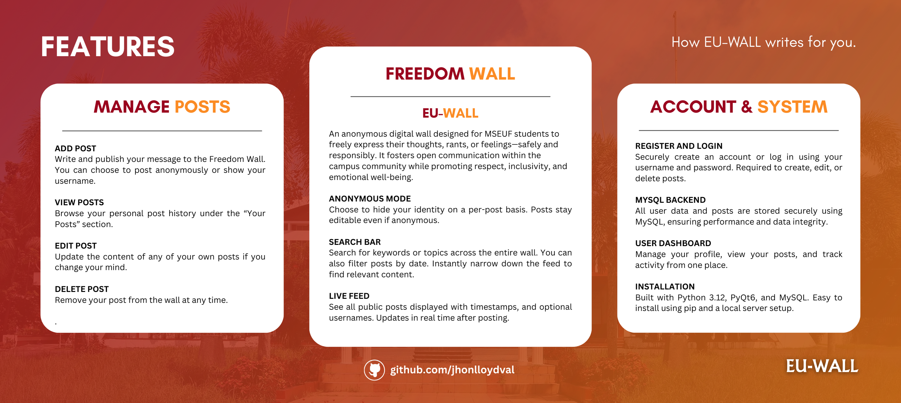
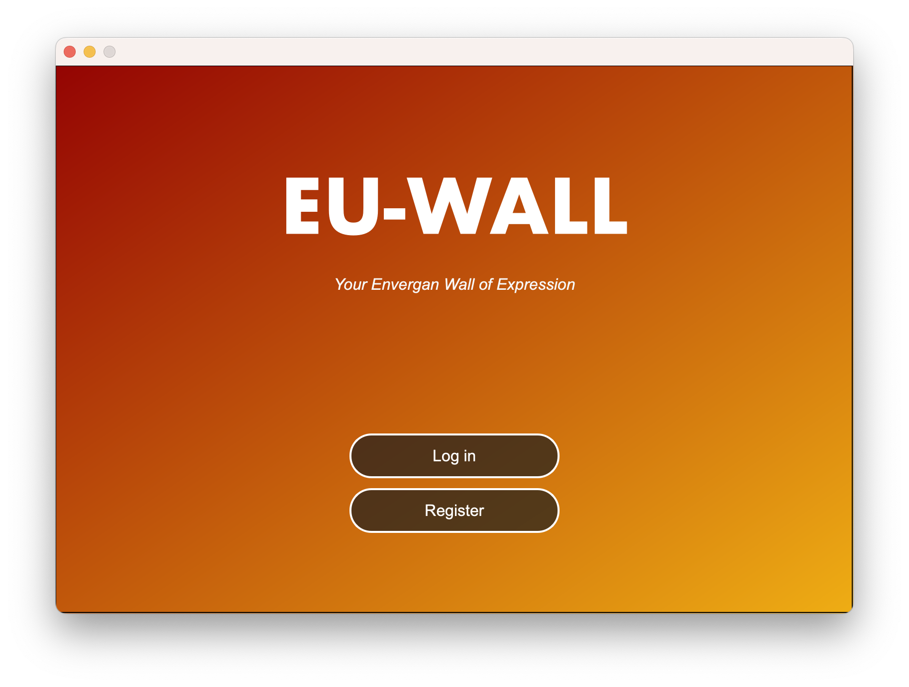
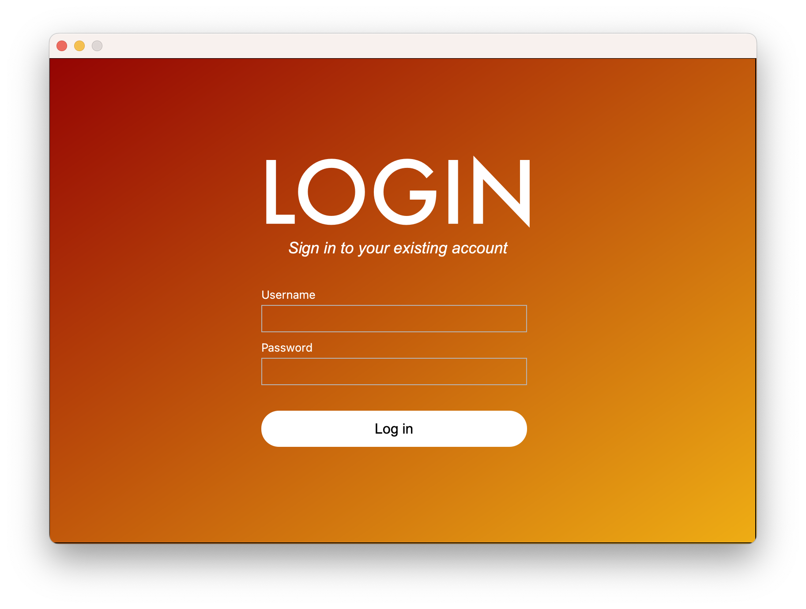
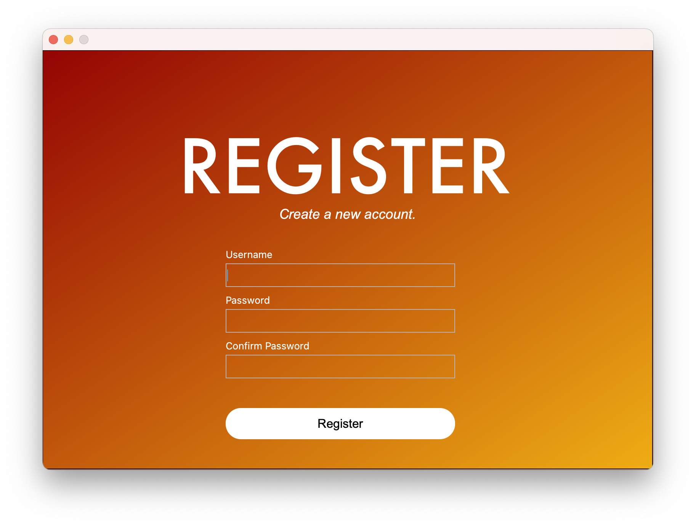
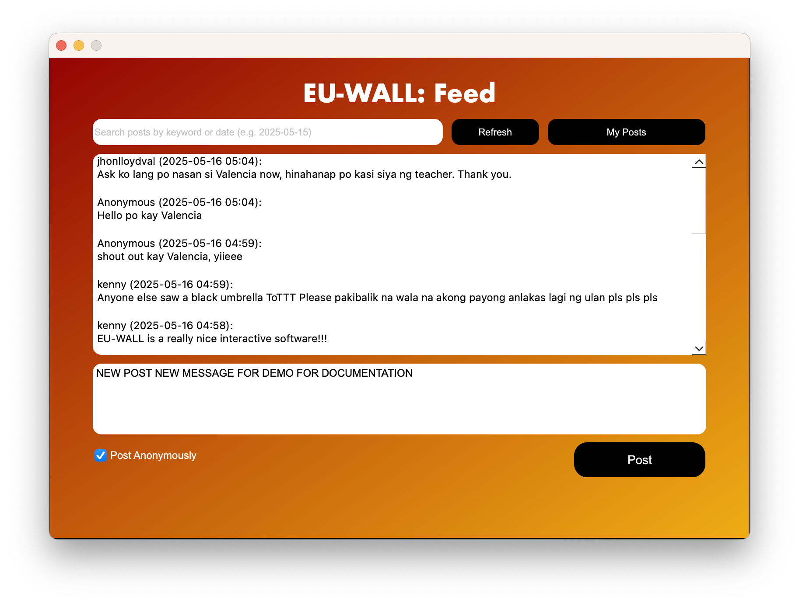
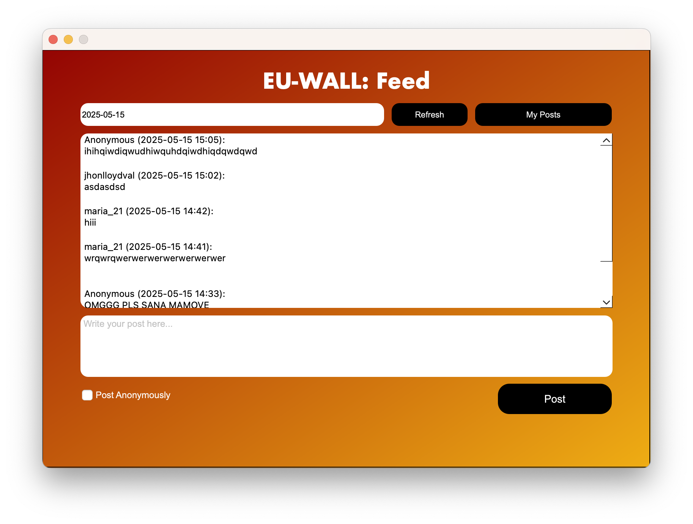
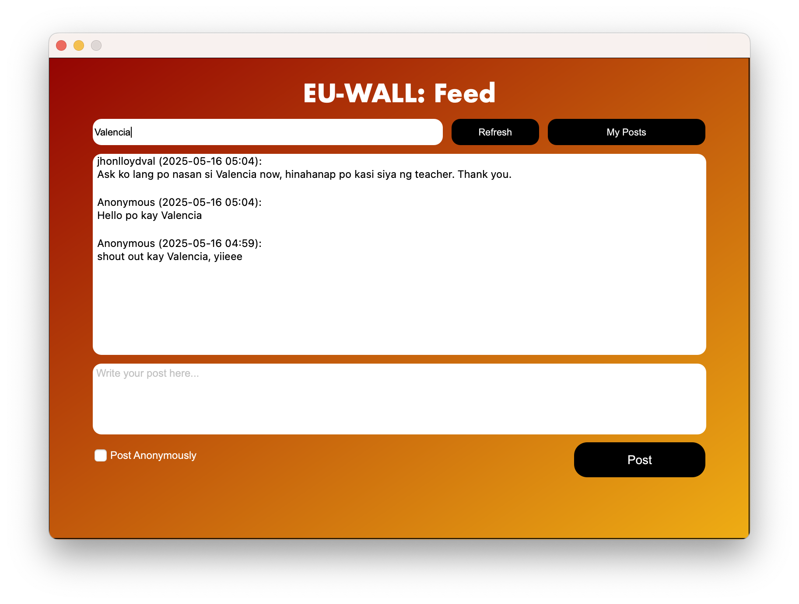
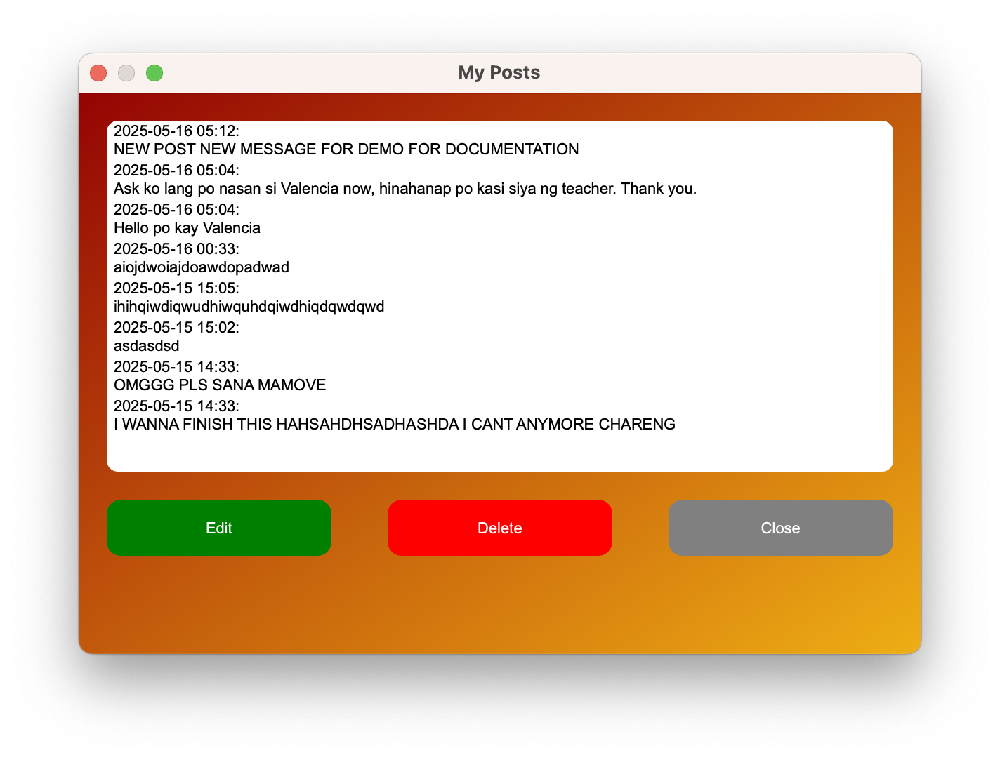

# **EU-WALL**
**EU-WALL: Your Envergan Wall of Expression**


## **Project Overview**
EU-WALL is a PyQt6 and MySQL-powered Freedom Wall application designed exclusively for the students of Manuel S. Enverga University Foundation (MSEUF). It provides a digital platform where users can post messages, thoughts, or rants—anonymously or not—fostering emotional expression, openness, and connection within the academic community.

This project aligns with and supports the following **Sustainable Development Goals (SDGs):**

- **SDG 3: Good Health and Well-being**  
  Promoting mental health and emotional well-being by providing a safe space for expression.

- **SDG 4: Quality Education**  
  Supporting inclusive education by giving every student a voice and fostering digital literacy.

- **SDG 9: Industry, Innovation, and Infrastructure**  
  Applying innovative digital solutions through software development and database integration.

- **SDG 16: Peace, Justice, and Strong Institutions**  
  Fostering a culture of peace and inclusivity through moderated yet open communication.

EU-WALL is designed to be a safe, moderated, and engaging space for self-expression while integrating responsible and innovative design practices aligned with student well-being and digital responsibility.



## **Features**
EU-WALL fosters emotional expression, campus unity, and responsible communication through the following functionalities:

| **Feature** | **Description** |
|-------------|-----------------|
| **Register/Login** | Create an account or log in to access the freedom wall and manage your posts. |
| **Freedom Wall Feed** | View all public posts (anonymous or not) with timestamps and usernames. |
| **Create Post** | Write and share messages with an option to post anonymously. |
| **Edit/Delete Post** | Manage your own posts through the "My Posts" section. |
| **Search Functionality** | Filter wall content by keywords or date of posting. |
| **Anonymous Posting** | Hide your identity while retaining ownership for future edits/deletes. |
| **Date & Time Stamp** | Automatic inclusion of timestamp upon posting. |

## **How It Works**

### 
### 
### 
1. **Welcome Screen, Register and Login**:  
   Users start at the welcome screen and can choose to register a new account or log in to an existing one. Registration requires creating a unique username and password.
   
### 
2. **Freedom Wall Feed**:  
   The main window displays all public posts with timestamps and usernames (if not anonymous). Users can read through the feed to see what others are sharing.

### 
3. **Create Post**:  
   Users can write their own messages and choose whether to post anonymously or with their username displayed. The post is then added to the public feed.

### 
### 
4. **Search Functionality**:  
   A search bar allows users to filter posts based on keywords or the date they were posted, making it easier to find specific content.

### 
5. **My Posts**:  
   Users can access a section showing all their freedom wall entries. Here, they can hover and click on specific entries to edit or delete their content.

## **Prerequisites**

You must have the following installed and set up before proceeding:

- **Python 3.12** or higher
- **MySQL Server** (e.g., XAMPP, WAMP, or standalone MySQL installation)
- **pip** (Python package installer)
- **PyQt6** and **PyQt6 Designer**
- **mysql-connector-python**

## **Installation**

### **Clone the Repository**

#### Option 1: Using Git
1. Open your terminal or command prompt.
2. Clone the repository by entering:
   ```bash
   git clone https://github.com/jhonlloydval/EU-WALL.git
   ```
3. Navigate to the project directory:
   ```bash
   cd EU-WALL
   ```

#### Option 2: Download as ZIP
1. Visit the repository at https://github.com/jhonlloydval/EU-WALL
2. Click on the "Code" button and select "Download ZIP".
3. Extract the downloaded ZIP file.
4. Open the extracted folder.

### **Set Up the Environment**

1. Install the required Python packages:
   ```bash
   pip install PyQt6 mysql-connector-python
   ```

2. Set up the MySQL database:
   - Ensure your MySQL server is running
   - Import the database schema using the provided `euwall_schema.sql` file:
     ```bash
     mysql -u your_username -p < euwall_schema.sql
     ```
   - Update database credentials in the code if necessary

3. Run the application:
   ```bash
   python main.py
   ```

## **Future Enhancements**
- GUI-based database configuration (e.g., admin panel)
- Admin moderation system (to report or manage abusive content)
- Profile customization (e.g., bio, photo, themes)
- Notification system for post interactions
- Cloud deployment for broader accessibility
- Enhanced UI/UX and mobile responsiveness

## **Sustainability Impact**
By providing a platform for emotional expression and fostering community connection, EU-WALL contributes to student well-being while creating a more inclusive and supportive academic environment. The project promotes mental health awareness, responsible digital communication, and innovative technological practices within the educational setting.

# **EU-WALL and Sustainable Development Goals (SDGs)**

## **Good Health and Well-being (SDG 3):**
- **Mental Health Support**: Provides students with a safe and anonymous platform to express thoughts, feelings, and struggles.
- **Reducing Stigma**: Encourages open discussion about personal issues and emotional well-being.

## **Quality Education (SDG 4):**
- **Inclusive Communication**: Gives every student a voice regardless of social status or communication preferences.
- **Digital Literacy**: Fosters responsible online communication and engagement skills.

## **Industry, Innovation, and Infrastructure (SDG 9):**
- **Technological Innovation**: Applies software development and database technologies to address campus needs.
- **Practical Learning**: Introduces students to real-world tech practices such as CRUD operations, GUI design, and database integration.

## **Peace, Justice, and Strong Institutions (SDG 16):**
- **Open Communication**: Enables moderated discussions that foster a culture of peace and inclusivity.
- **Accountability**: Emphasizes responsible expression even in anonymous settings.

---
## **How EU-WALL Supports These Goals:**
- **User-Centered Design**: Easy-to-use interface that prioritizes privacy and self-expression.
- **Community-Building**: Creates connections among students through shared experiences.
- **Responsible Digital Space**: Balances freedom of expression with accountability and moderation.
---

## **License**
This project is open-source and available under the MIT License.

# **About the Developer**
Hello! I am Jhon Lloyd M. Valencia, a first-year Computer Science student specializing in software engineering. I'm currently learning GUI development, specifically with PyQt6 and tkinter. EU-WALL represents my final output for the Computer Programming II course, which focuses on GUI development.

This project combines my interest in creating meaningful applications with my academic learning journey. EU-WALL is not just a technical exercise—it's designed to address real needs within our university community by providing a platform for free expression and connection.

I welcome any feedback, suggestions, or questions about EU-WALL. Feel free to reach out!

Let's Connect!  
**Email**: jhonlloydval@gmail.com  
**GitHub**: jhonlloydval  
**LinkedIn**: jhonlloydval  
**Instagram**: jhonlloydval